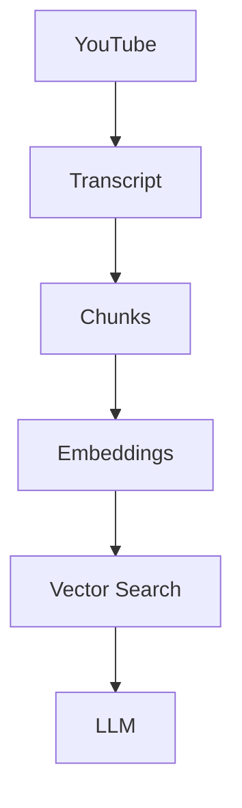
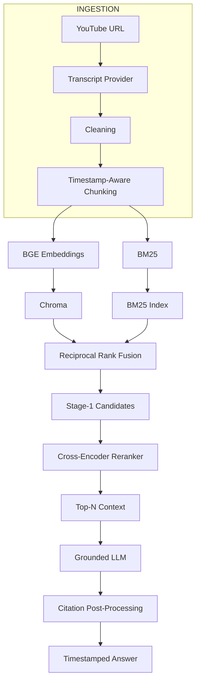
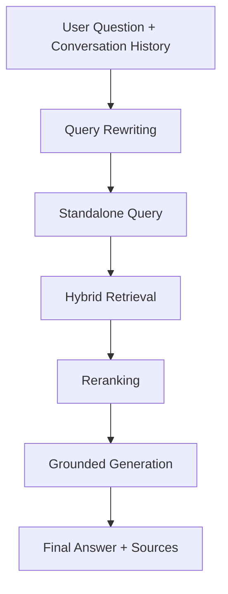
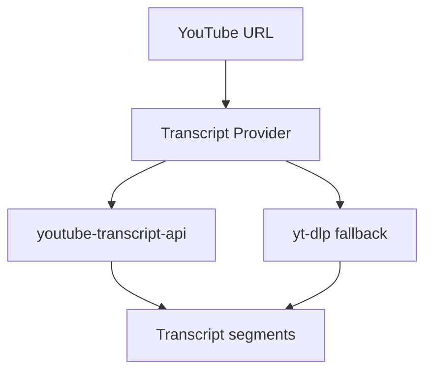
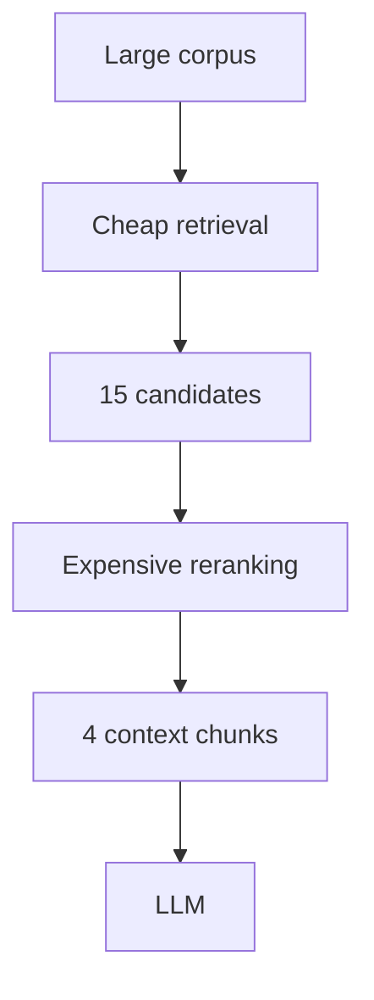
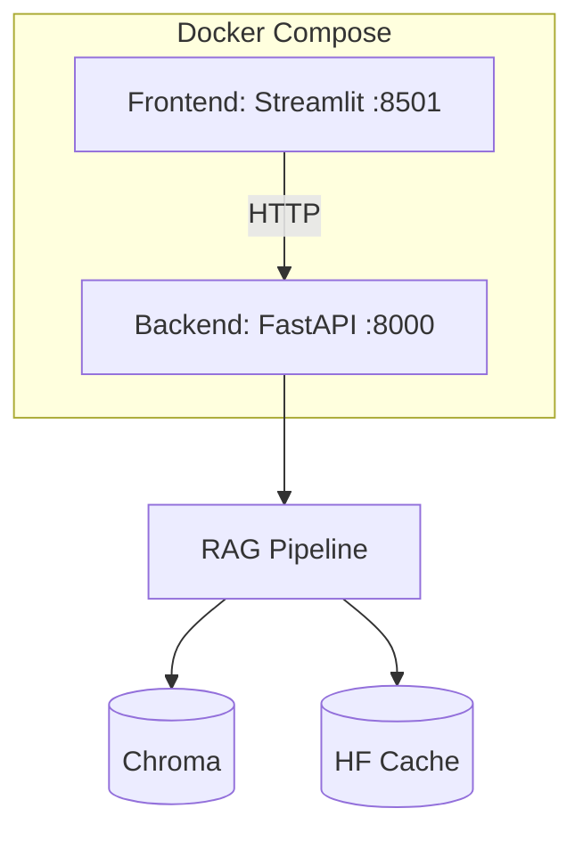
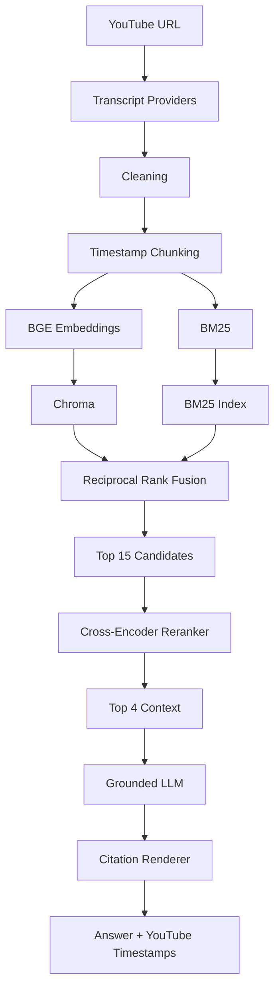

```markdown
# 🎬 YouTube RAG Assistant

**Grounded, conversational Q&A over YouTube video transcripts — with clickable timestamp citations, hybrid retrieval, Reciprocal Rank Fusion, cross-encoder reranking, conversation-aware query rewriting, evaluation, FastAPI, Streamlit, and Docker.**

> **Built to explore a practical question: what actually happens when a RAG system stops being a simple `embed → retrieve → generate` demo?**

Paste a YouTube URL → the system extracts and cleans the transcript → creates timestamp-aware chunks → indexes them using both semantic and lexical retrieval → fuses the results with RRF → reranks candidates with a cross-encoder → generates a grounded answer → maps citations back to the exact part of the video.

---

## 📌 Table of Contents

1. [Problem](#problem)
2. [Solution](#solution)
3. [Architecture](#architecture)
4. [What Makes This More Than Basic RAG](#what-makes-this-more-than-basic-rag)
5. [The RAG Pipeline](#the-rag-pipeline)
6. [Transcript Ingestion](#1-transcript-ingestion)
7. [Transcript Cleaning](#2-transcript-cleaning)
8. [Timestamp-Aware Chunking](#3-timestamp-aware-chunking)
9. [Embeddings](#4-embeddings)
10. [Vector Storage](#5-vector-storage)
11. [Hybrid Retrieval](#6-hybrid-retrieval)
12. [Reciprocal Rank Fusion](#7-reciprocal-rank-fusion)
13. [Cross-Encoder Reranking](#8-cross-encoder-reranking)
14. [Grounded Generation](#9-grounded-generation)
15. [Citation System](#10-citation-system)
16. [Conversation Memory](#11-conversation-memory)
17. [Query Rewriting](#12-query-rewriting)
18. [Long Videos](#13-long-videos)
19. [Multiple Videos](#14-multiple-videos)
20. [Where RAG Broke and How I Fixed It](#where-rag-broke-and-how-i-fixed-it)
21. [Architectural Decisions](#architectural-decisions)
22. [Evaluation](#evaluation)
23. [Debug Mode](#debug-mode)
24. [API](#api)
25. [Configuration](#configuration)
26. [Project Structure](#project-structure)
27. [Testing](#testing)
28. [Docker](#docker)
29. [Quickstart](#quickstart)
30. [Example](#example)
31. [Engineering Lessons](#engineering-lessons)
32. [Limitations](#limitations)
33. [Future Work](#future-work)
34. [Security](#security)

---

## Problem

Technical knowledge is increasingly stored inside long-form video.

A 60–90 minute technical lecture may contain the exact answer to a question for only 30–60 seconds.

Finding that answer manually means:
- Scrubbing through the timeline.
- Relying on coarse or missing chapter markers.
- Reading large, noisy ASR transcripts.
- Remembering approximately where the speaker discussed a topic.

A naive RAG implementation seems to solve this:



But this creates another set of problems. A real system has to answer questions such as:
- What if semantic search misses an exact technical term?
- What if BM25 finds the right words but wrong context?
- What if the best semantic result is not the best final result?
- How large should chunks be?
- What happens when the answer lies across a chunk boundary?
- How do we preserve timestamps after cleaning?
- How do we prevent the LLM from using information outside the video?
- What happens when the user asks a follow-up question?
- What happens when the LLM API returns `429`?
- How do we distinguish an actual model refusal from an infrastructure failure?
- How do we know whether reranking actually improved retrieval?
- How do we test the system without downloading models or calling an LLM?
- How do we deploy the exact same system with Docker?

This project was built around those engineering problems.

---

## Solution

The final system uses a two-stage retrieval architecture:



The query path additionally supports conversation memory and query rewriting:



---

## Architecture

### High-Level Architecture

```mermaid
graph TD
    A[YouTube URL] --> B[Transcript Extraction<br/>youtube-transcript-api / yt-dlp fallback]
    B --> C[Transcript Cleaning]
    C --> D[Timestamp-Aware Chunking<br/>target: 160, max: 240, overlap: 40]
    D --> E[BGE Embeddings<br/>bge-small-en-v1.5]
    D --> F[BM25 Index<br/>lexical retrieval]
    E --> G[Chroma Vector Store]
    F --> H[BM25 Retrieval]
    G --> I[Reciprocal Rank Fusion]
    H --> I
    I --> J[Stage-1 Candidate Set<br/>top-K = 15]
    J --> K[Cross-Encoder Reranker<br/>ms-marco-MiniLM-L-6-v2]
    K --> L[Final Context<br/>top-N = 4]
    L --> M[Grounded LLM<br/>GPT-OSS-120B / OpenAI-compatible API]
    M --> N[Citation Renderer<br/>[C1] → YouTube timestamp]
    N --> O[Final Answer]
```

The architecture is intentionally modular. Major subsystems are separated behind interfaces so that components can be replaced without rewriting the entire pipeline.

---

## What Makes This More Than Basic RAG

The core pipeline is not:
```text
embed → retrieve → prompt → generate
```

Instead:
```text
ingest
   ↓
clean
   ↓
timestamp-aware chunk
   ↓
embed
   ↓
vector retrieval + BM25 retrieval
   ↓
RRF
   ↓
cross-encoder reranking
   ↓
context construction
   ↓
grounded generation
   ↓
citation validation/rendering
```

Around this core are:
```text
conversation memory, query rewriting, evaluation, failure detection, 
debug tracing, FastAPI, Streamlit, Docker, automated tests
```

The important engineering goal was not to maximize the number of components. It was to understand why each component exists and remove components that were adding complexity without solving the core problem.

---

## The RAG Pipeline

### 1. Transcript Ingestion
The ingestion layer converts a YouTube video into a structured transcript. The pipeline uses a provider abstraction so transcript acquisition is not tightly coupled to one implementation.



The resulting segments retain their timing information (`text`, `start_time`, `duration / end_time`). This timing information is preserved throughout the pipeline because timestamp citations are a product requirement, not an afterthought.

### 2. Transcript Cleaning
Raw transcript data can contain artifacts such as `[Music]`, `[Applause]`, `♪`, URLs, excessive whitespace, and rolling-caption duplication. Cleaning is performed before indexing. 

> **Rule:** Clean the text without changing the timeline. Timestamps are never shifted by text normalization.

### 3. Timestamp-Aware Chunking
The system does not use arbitrary fixed-character splitting. The current chunker is designed around:
- `target tokens = 160`
- `maximum tokens = 240`
- `overlap = 40`

The chunker merges transcript segments, attempts to split on sentence boundaries, preserves temporal information, uses whole-sentence overlap, avoids tiny orphan fragments, and maps text back to the original timeline. Each chunk carries metadata: `chunk_id`, `video_id`, `video_url`, `title`, `start_time`, `end_time`, `index`, `text`.

**Why Sentence-Aware Chunking?**
If the semantic unit is split badly, retrieval may receive incomplete information. Overlap helps preserve answers that cross boundaries.

**Timestamp Interpolation**
Transcript APIs often provide timestamps for caption segments rather than every sentence. When a chunk contains multiple sentences inside one caption segment, the system estimates the sentence-level position inside that interval, allowing the final citation to point closer to the actual relevant content.

### 4. Embeddings
The default embedding model is `BAAI/bge-small-en-v1.5` (384 dimensions) using the `sentence-transformers` implementation. It provides a useful balance between retrieval quality, memory requirements, CPU compatibility, local development speed, and Docker practicality. A deterministic hashing embedder is also available for offline testing.

### 5. Vector Storage
The primary vector backend is `Chroma`, with a memory-backed implementation also supported. This separation allows persistent Chroma for production and in-memory stores for tests/offline evaluation. Metadata such as `video_id` allows per-video and cross-video retrieval.

### 6. Hybrid Retrieval
The system uses two retrieval signals:
- **Vector Retrieval:** Useful for paraphrases (e.g., Query: "Why does the model need embeddings?" → Transcript: "Characters are represented using learned vectors.").
- **BM25 Retrieval:** Provides lexical matching, particularly useful for exact technical terminology, specific numbers, and code identifiers.

### 7. Reciprocal Rank Fusion
Vector similarity and BM25 scores do not naturally live on the same numerical scale. The system uses Reciprocal Rank Fusion (RRF): `RRF(d) = Σ 1 / (k + rank(d))` with `k = 60`. This allows both retrieval methods to contribute based on ranking position.

### 8. Cross-Encoder Reranking
Hybrid retrieval is the first stage. The top candidates are reranked using `cross-encoder/ms-marco-MiniLM-L-6-v2`. The architecture deliberately uses a "retrieve wide, rerank narrow" funnel:

The final reranking score combines cross-encoder relevance with a small stage-1 ranking prior to prevent strong initial candidates from being completely discarded due to minor second-stage scoring differences.

### 9. Grounded Generation
The LLM is given only the retrieved context. The prompt instructs the model to answer using the supplied context, avoid inventing unsupported information, cite factual claims, and refuse when the video does not contain enough information. The current production model is `openai/gpt-oss-120b` through an OpenAI-compatible API.

### 10. Citation System
The LLM uses internal citation markers (`[C1]`, `[C2]`). The application converts these into timestamped YouTube links (e.g., `[1:05:29](https://youtube.com/watch?v=VIDEO_ID&t=3929s)`). The renderer tracks cited sources, removes invalid markers, and preserves timestamp metadata.

### 11. Conversation Memory
The system maintains conversation state using a TTL-based conversation store (`history_turns_for_rewrite = 4`, `conversation_ttl_minutes = 120`). This keeps conversational context useful without allowing history to grow indefinitely.

### 12. Query Rewriting
Follow-up questions can be incomplete. The system performs lightweight heuristic query rewriting before retrieval to generate a standalone query, removing the need for a second, latency-inducing LLM call.

### 13. Long Videos
The system scales through retrieval. The amount of context seen by the LLM depends primarily on `retrieval_top_k`, `rerank_top_n`, and `chunk size`, rather than the total duration of the video.

### 14. Multiple Videos
Videos can be ingested individually into a shared store. Retrieval can be scoped to a specific video or all indexed videos, with citation metadata retaining the source video.

---

## Where RAG Broke and How I Fixed It

This section details how the system was repeatedly tested against its own failure modes.

1. **Too Many Chunking Strategies:** Maintained multiple strategies (`TimestampChunker`, `SentenceChunker`, `FixedTokenChunker`), creating unnecessary branching. *Fix:* Simplified to a single timestamp-aware implementation, reducing configuration surface and test complexity.
2. **Multimodal Infrastructure Was Not Core:** Added dependencies and deployment complexity without solving the core transcript RAG problem. *Fix:* Removed the unused multimodal pipeline.
3. **Playlist Ingestion Expanded the Scope:** Added unnecessary routes, schemas, and UI. *Fix:* Removed playlist ingestion; the unit of ingestion is now a single video.
4. **LLM-Based Query Rewriting Added Another Failure Point:** Introduced additional latency, API usage, and rate-limit surfaces. *Fix:* Changed to a lightweight heuristic implementation.
5. **LLM-as-a-Judge Made Evaluation Dependent on Another LLM:** Made evaluation non-deterministic and rate-limit sensitive. *Fix:* Simplified to a deterministic heuristic judge measuring correctness, faithfulness, context relevance, citation accuracy, and refusal correctness.
6. **Cross-Encoder Could Silently Fall Back:** A dangerous production failure where the system silently replaces a required component with a weaker fallback. *Fix:* Production reranking explicitly disables silent fallback (`allow_fallback=False`).
7. **Reranking Could Overrule Useful Stage-1 Ranking:** Blindly discarding stage-1 ranking information created unstable ordering. *Fix:* Final score combines cross-encoder relevance with a small stage-1 ranking prior.
8. **LLM Rate Limits Looked Like Model Refusals:** HTTP `429` responses were misclassified as model refusals. *Fix:* The RAG engine now explicitly tracks `generation_status = error` separately from model behavior.
9. **Evaluation Reports Failed on Windows Encoding:** Unicode characters failed with default system encoding. *Fix:* Reports are explicitly written as UTF-8 (`encoding="utf-8"`).
10. **Docker Build and Runtime Are Different Problems:** Local success did not guarantee Docker success. *Fix:* Validated through both `docker compose build` and `docker compose up -d`, ensuring the health endpoint returns `status: ok`.
11. **"Container Is Running" Is Not Enough:** An `Up` state does not prove correct initialization. *Fix:* Backend exposes `GET /health` to validate the configured pipeline successfully initialized.
12. **Feature Removal Left Stale Configuration:** Removed features left behind environment variables and imports. *Fix:* Searched the repository for stale references (e.g., `multimodal`, `playlist`, `LLMJudge`) to ensure end-to-end removal.

---

## Architectural Decisions

- **Why Hybrid Retrieval?** Semantic and lexical retrieval fail differently. Hybrid combines strong semantic similarity with strong lexical matching.
- **Why RRF?** Vector similarity and BM25 scores are not directly comparable. RRF operates on ranking position, avoiding arbitrary score normalization.
- **Why Cross-Encoder Reranking?** Enables a "retrieve-wide/rerank-narrow" architecture, allowing slower, more accurate models to process a small candidate set.
- **Why BGE-small?** Provides a useful quality/resource trade-off for developer machines and Docker environments.
- **Why Chroma?** Provides persistent local storage, similarity search, metadata filtering, and simple deployment without requiring a separate vector database server.
- **Why Not LangChain or LlamaIndex?** Keeps major RAG stages explicit and inspectable. The trade-off of manual implementation is intentional for testability.
- **Why a Raw OpenAI-Compatible Client?** Keeps the RAG engine separate from the LLM provider, allowing easy endpoint switching.
- **Why a Deterministic Offline Path?** Provides `HashingEmbedder`, `MemoryVectorStore`, `MockLLM`, and `HeuristicReranker` for testing without API keys, networks, or large model downloads.

---

## Evaluation

Evaluation is treated as part of the application, not a one-off notebook. Run `python scripts/evaluate.py --help`.

### Current Retrieval Evaluation
Latest hybrid + cross-encoder run (17 questions):

| Metric | Stage 1 | Stage 2 |
| :--- | :--- | :--- |
| **MRR** | 0.9000 | **0.9222** |
| **Recall@1** | 0.3800 | **0.3933** |
| **Recall@3** | 0.6978 | **0.7311** |
| **Recall@5** | **0.8200** | 0.8156 |
| **Recall@10** | **0.9200** | 0.8156 |
| **Precision@1** | 0.8000 | **0.8667** |
| **Precision@3** | 0.5556 | **0.5778** |
| **Precision@5** | 0.4400 | 0.4133 |
| **Precision@10** | 0.2600 | 0.2067 |
| **HitRate@1** | 0.8000 | **1.0000** |
| **HitRate@3** | 1.0000 | 1.0000 |
| **HitRate@5** | 1.0000 | 1.0000 |
| **HitRate@10** | 1.0000 | 1.0000 |
| **nDCG@1** | 0.8000 | **0.8667** |
| **nDCG@3** | 0.8090 | **0.8620** |
| **nDCG@5** | 0.8530 | **0.9283** |
| **nDCG@10** | 0.9053 | **0.9283** |

> **Note:** These are regression measurements for this system and dataset, not a general benchmark for RAG.

### Generation Evaluation
Tracks answer correctness, faithfulness, context relevance, citation accuracy, and refusal correctness. LLM API failures (`429`) are explicitly separated from model refusal behavior in evaluation reports.

---

## Debug Mode

Instead of seeing only the final answer, the system can expose the entire retrieval path:
```text
original query → rewritten query → retrieval mode → vector candidates → 
BM25 candidates → RRF scores → reranked candidates → final context → 
LLM → timings
```
A typical debug trace contains:
```text
[ctx] [1:05:29–1:06:00]
vec=0.758354, bm25=8.1409, fused=0.032002, rerank=0.820784
```
CLI: `/debug on` or `/debug off`.

---

## API

The backend is implemented using FastAPI. Interactive documentation: `http://localhost:8000/docs`

### Core Endpoints
| Method | Endpoint | Purpose |
| :--- | :--- | :--- |
| `POST` | `/videos/process` | Ingest a YouTube video |
| `GET` | `/videos` | List ingested videos |
| `GET` | `/videos/{video_id}` | Get video metadata |
| `GET` | `/videos/{video_id}/sources` | Get stored timestamped chunks |
| `DELETE` | `/videos/{video_id}` | Remove a video |
| `POST` | `/chat` | Ask a grounded question |
| `GET` | `/health` | Check application health |

### Chat Request / Response
```json
// Request
{
  "query": "Why does the model use embeddings?",
  "video_id": "TCH_1BHY58I",
  "conversation_id": null,
  "top_k": 15,
  "top_n": 4,
  "debug": true
}

// Response
{
  "answer": "The model uses embeddings to represent characters...",
  "answer_markdown": "The model uses embeddings...[1:05:29](...)",
  "sources": [{ "video_id": "TCH_1BHY58I", "start_time": 3929.0, "end_time": 3960.0, "score": 0.82, "text": "..." }],
  "cited_indices": [0],
  "conversation_id": "..."
}
```

---

## Configuration

| Configuration | Default |
| :--- | :--- |
| `EMBEDDING_PROVIDER` | `sentence-transformers` |
| `EMBEDDING_MODEL` | `BAAI/bge-small-en-v1.5` |
| `EMBEDDING_DIM` | `384` |
| `VECTORSTORE_BACKEND` | `chroma` |
| `RETRIEVAL_MODE` | `hybrid` |
| `RETRIEVAL_TOP_K` | `15` |
| `RERANK_TOP_N` | `4` |
| `RERANKER_ENABLED` | `true` |
| `RERANKER_MODEL` | `cross-encoder/ms-marco-MiniLM-L-6-v2` |
| `HYBRID_VECTOR_WEIGHT` | `1.0` |
| `HYBRID_BM25_WEIGHT` | `1.0` |
| `RRF_K` | `60` |
| `CHUNK_TARGET_TOKENS` | `160` |
| `CHUNK_MAX_TOKENS` | `240` |
| `CHUNK_OVERLAP_TOKENS` | `40` |
| `LLM_PROVIDER` | `groq` |
| `LLM_MODEL` | `openai/gpt-oss-120b` |
| `LLM_TEMPERATURE` | `0.1` |
| `LLM_MAX_TOKENS` | `1024` |
| `LLM_TIMEOUT_S` | `60` |
| `REWRITER_ENABLED` | `true` |
| `HISTORY_TURNS_FOR_REWRITE` | `4` |
| `CONVERSATION_TTL_MINUTES` | `120` |

---

## Project Structure

```text
YouTube-RAG/
├── app/
│   ├── api/main.py
│   ├── config/settings.py
│   ├── evaluation/ (judges.py, runner.py)
│   ├── generation/ (base.py, openai_compat.py, rag_engine.py)
│   ├── ingestion/ (chunking.py, service.py, youtube.py)
│   └── retrieval/ (bm25.py, hybrid.py, reranker.py, vectorstore.py)
├── frontend/streamlit_app.py
├── scripts/ (chat.py, evaluate.py)
├── tests/
├── data/ (eval/, fixtures/)
├── Dockerfile
├── docker-compose.yml
├── requirements.txt
├── pytest.ini
├── .env.example
└── README.md
```

---

## Testing

The project uses `pytest`. Run the complete suite: `pytest -q`.

The test suite covers chunking, retrieval, BM25, RRF, reranking, RAG engine, query rewriting, evaluation, YouTube utilities, configuration, and API behavior. The testing principle is: *Change architecture → Run focused tests → Run full suite → Only then continue.*

---

## Docker

The project contains Docker support for both backend and frontend.

```bash
docker compose build
docker compose up -d
docker compose ps
```

### Docker Architecture

The setup uses a persistent Hugging Face cache volume so model files do not need to be downloaded repeatedly.

---

## Quickstart

### Option A — Docker
```bash
cp .env.example .env
# Configure your LLM credentials in .env
docker compose up --build
```
- Frontend: `http://localhost:8501`
- API: `http://localhost:8000`
- API docs: `http://localhost:8000/docs`

### Option B — Local
```bash
python -m venv .venv
source .venv/bin/activate  # Linux/macOS
# .venv\Scripts\activate   # Windows
pip install -r requirements.txt
cp .env.example .env
uvicorn app.api.main:app --reload
# In another terminal: streamlit run frontend/streamlit_app.py
```

---

## Chat CLI

```bash
python scripts/chat.py <video_id>        # For an already ingested video
python scripts/chat.py --all             # Cross-video
```
Supports: `/debug on`, `/debug off`, `/video <video_id>`, `/video all`, `/quit`.

---

## Evaluation Commands

```bash
# Hybrid retrieval
python scripts/evaluate.py --embedding bge --mode hybrid --store chroma

# Vector-only
python scripts/evaluate.py --embedding bge --mode vector --store chroma

# BM25
python scripts/evaluate.py --embedding bge --mode bm25 --store chroma

# Without reranking
python scripts/evaluate.py --embedding bge --mode hybrid --no-rerank --store chroma
```

---

## Example

**User:** "What is the main idea behind using an MLP in the makemore model?"

**System Process:**
1. Rewrites the query if required.
2. Embeds the question.
3. Runs vector retrieval and BM25.
4. Fuses the rankings with RRF.
5. Reranks the candidates.
6. Selects the final context.
7. Generates a grounded answer.
8. Maps citations to video timestamps.

**Result:**
> The MLP is used to predict the next character by learning a richer representation than the earlier simpler model.
> [0:01] | [2:18] | [52:46]

---

## Engineering Lessons

1. **RAG quality starts with retrieval:** Better retrieval → Better context → Better grounded generation.
2. **Hybrid retrieval is useful:** Semantic and lexical retrieval fail in different ways; using both increases recovery opportunities.
3. **Reranking is valuable:** The first-stage retriever is optimized for recall/efficiency; the cross-encoder spends computation on a smaller candidate set.
4. **Production failures must be separated from model behavior:** An API timeout or `429` is not a hallucination or refusal.
5. **Observability changes debugging:** Exposing vector scores, BM25 scores, RRF scores, rerank scores, and stage timings makes the retrieval path inspectable.
6. **Removing complexity is also engineering:** Features must justify their maintenance cost. Unused infrastructure was deliberately removed.
7. **Evaluation should be reproducible:** Reports must preserve per-question details so aggregate numbers do not hide individual failures.

---

## Limitations

- **Transcript quality:** Depends on YouTube ASR (missing punctuation, mistakes, repeated captions).
- **YouTube access:** External access restrictions or blocks cannot always be eliminated by application code.
- **Evaluation size:** Current dataset is small; metrics are system regression measurements, not general RAG benchmarks.
- **Heuristic evaluation:** Lexical judges may score semantically correct paraphrases lower than expected.
- **LLM dependency:** Real generation requires an available LLM provider; mock generators are for testing only.
- **CPU inference:** Default configuration is designed for developer machines; GPU inference would reduce latency for larger workloads.

---

## Future Work

- **Retrieval:** Larger evaluation datasets, query expansion, better retrieval weighting, multilingual embeddings, advanced rerankers.
- **Generation:** Streaming responses, stronger citation verification, structured answers, answer confidence estimation.
- **Evaluation:** Human-labeled real-video QA datasets, larger regression suites, retrieval error categorization, automated dashboards.
- **Infrastructure:** pgvector, Qdrant, Redis-backed conversation memory, background ingestion workers, caching, authentication, rate limiting, observability, distributed deployment.

---

## Security

- Never commit API credentials. Use `.env` for local secrets.
- Only commit `.env.example` with placeholder values.
- If an API key is accidentally exposed: 1. Revoke/rotate immediately, 2. Remove from repository, 3. Check Git history, 4. Replace with a new key.
- Secrets should never be baked into Docker images.

---

## Reproducibility Checklist

```bash
# 1. Run the full test suite
pytest -q

# 2. Run the evaluation
python scripts/evaluate.py --embedding bge --mode hybrid --store chroma

# 3. Build and run Docker
docker compose build
docker compose up -d
docker compose ps

# 4. Check backend health
curl http://localhost:8000/health
# or PowerShell: Invoke-RestMethod http://localhost:8000/health
```
The goal is that the same repository can be tested, evaluated, built, and deployed without relying on undocumented local state.

---

## Final Architecture Summary



---

## The Core Idea

> **Building a RAG demo is easy. Building one that you can inspect, evaluate, debug, deploy, and recover when individual components fail is the actual engineering problem.**

This project focuses not only on *"Can the LLM answer?"* but also on:
- Where did the answer come from?
- Why was this chunk retrieved, and why was another rejected?
- Did reranking improve the result? Was the query rewritten?
- Was the generation successful, and was the citation actually used?
- What happens when the LLM fails?
- Can the system be evaluated without the LLM, run inside Docker, and tested deterministically?

That is the problem this repository is designed to explore.
```
