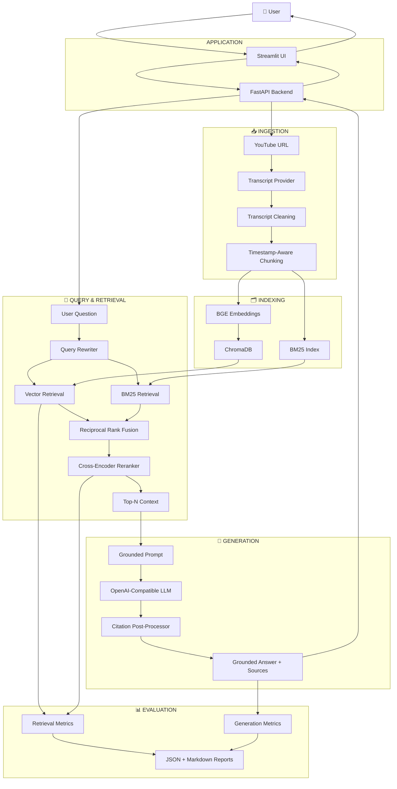
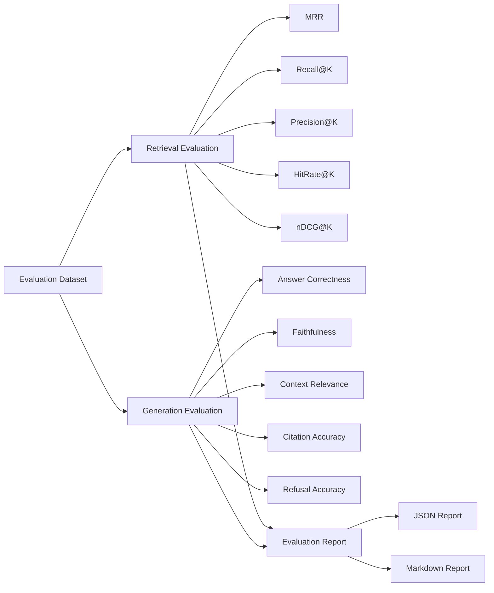
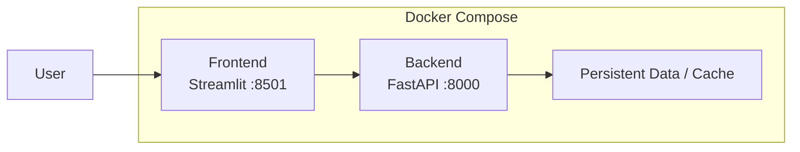
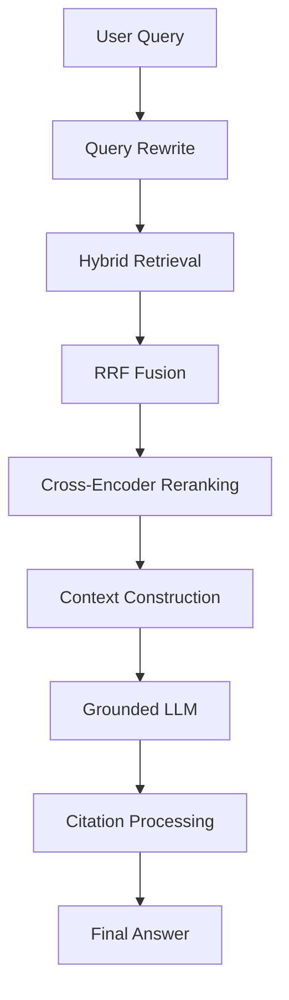
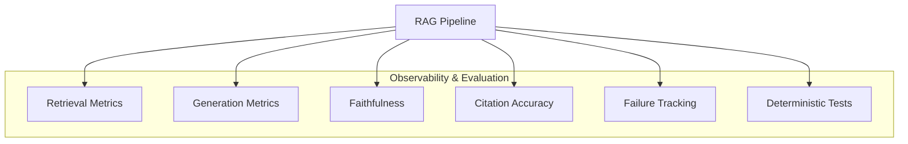
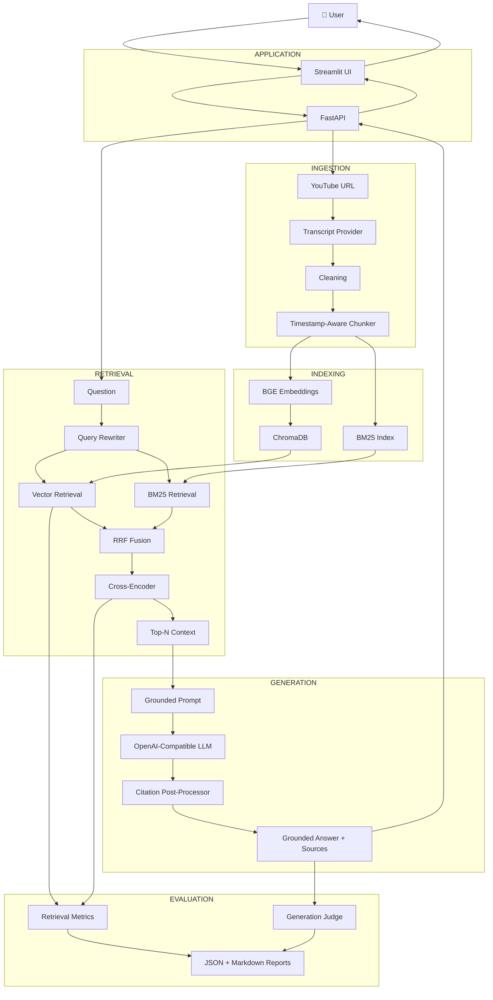

# 🎬 YouTube RAG Assistant

### Production-oriented Retrieval-Augmented Generation for YouTube technical content

> **I didn't just build a RAG application. I built a production-oriented RAG system — and then deliberately looked for where the pipeline breaks, measured those failures, and engineered around them.**

A conversational RAG system for asking grounded questions about YouTube technical videos.

Paste a YouTube URL → extract the transcript → clean it → create timestamp-aware chunks → index using semantic and lexical retrieval → fuse candidates with Reciprocal Rank Fusion → rerank with a cross-encoder → construct a constrained context → generate a grounded answer → resolve citations into clickable YouTube timestamps.

The project is designed around a simple question:

> **What happens when you stop treating RAG as `embed → retrieve → generate` and start treating it as an engineering system?**

---

## ✨ What makes this project different?

A basic RAG implementation can be summarized as:

```text
Document
   ↓
Chunk
   ↓
Embedding
   ↓
Vector Database
   ↓
Similarity Search
   ↓
LLM
```

That is enough to demonstrate the concept.

It is not enough to understand where a real RAG pipeline fails.

This project was built around those failure points:

```text
Bad transcript
      ↓
Bad chunks
      ↓
Weak retrieval
      ↓
Missing lexical matches
      ↓
Wrong ranking
      ↓
Irrelevant context
      ↓
Ungrounded generation
      ↓
Wrong citations
      ↓
Evaluation contamination
      ↓
Deployment failures
```

Instead of hiding these problems, the system makes them:

```text
Observable
     ↓
Measurable
     ↓
Testable
     ↓
Debuggable
     ↓
Fixable
```

---

# 📌 Table of Contents

- [Problem](#-problem)
- [Solution](#-solution)
- [System Architecture](#-system-architecture)
- [What Makes This More Than Basic RAG](#-what-makes-this-more-than-basic-rag)
- [End-to-End Pipeline](#-end-to-end-pipeline)
- [1. Transcript Ingestion](#1-transcript-ingestion)
- [2. Transcript Cleaning](#2-transcript-cleaning)
- [3. Timestamp-Aware Chunking](#3-timestamp-aware-chunking)
- [4. BGE Embeddings](#4-bge-embeddings)
- [5. ChromaDB](#5-chromadb)
- [6. BM25 Retrieval](#6-bm25-retrieval)
- [7. Hybrid Retrieval](#7-hybrid-retrieval)
- [8. Reciprocal Rank Fusion](#8-reciprocal-rank-fusion)
- [9. Cross-Encoder Reranking](#9-cross-encoder-reranking)
- [10. Context Construction](#10-context-construction)
- [11. Grounded Generation](#11-grounded-generation)
- [12. Citation Architecture](#12-citation-architecture)
- [13. Conversation Memory](#13-conversation-memory)
- [14. Query Rewriting](#14-query-rewriting)
- [15. Long Videos](#15-long-videos)
- [16. Caching](#16-caching)
- [Where RAG Broke](#-where-rag-broke--and-how-i-fixed-it)
- [Architectural Decisions](#-architectural-decisions)
- [Evaluation](#-evaluation)
- [Evaluation Failures](#-evaluation-failures)
- [Debugging and Observability](#-debugging-and-observability)
- [Testing](#-testing)
- [Docker](#-docker)
- [API Architecture](#-api-architecture)
- [Project Structure](#-project-structure)
- [Configuration](#-configuration)
- [Reproducibility](#-reproducibility)
- [Engineering Workflow](#-engineering-workflow)
- [Lessons Learned](#-lessons-learned)
- [Known Limitations](#-known-limitations)
- [Future Work](#-future-work)
- [Tech Stack](#-tech-stack)
- [Final Architecture](#-final-architecture)

---

# 🎯 Problem

Technical knowledge is increasingly stored inside long-form video.

A 60–90 minute technical lecture may contain the exact answer to a question in only a 30–60 second section.

Finding that answer manually means:

- scrubbing through the timeline
- searching a noisy transcript
- relying on coarse chapter markers
- remembering approximately where a topic was discussed
- watching large portions of the video just to find one explanation

A naive RAG system appears to solve this.

But video introduces additional problems.

The source is not just text.

It is:

```text
Video
  ↓
Transcript
  ↓
Timestamped transcript segments
  ↓
Meaningful chunks
  ↓
Retrievable evidence
```

If timestamps disappear during preprocessing, the system may retrieve the correct text but lose the ability to tell the user **where that information actually came from**.

If chunking is poor, retrieval becomes weaker.

If retrieval is weak, generation receives bad evidence.

If generation is not grounded, the answer can sound correct while being unsupported.

If citations are generated directly by the LLM, the system can produce invalid or incorrect links.

And if evaluation does not distinguish API failures from model failures, the evaluation itself becomes unreliable.

The project therefore treats RAG as a complete engineering pipeline rather than a single retrieval call.

---

# 💡 Solution

The final system uses a multi-stage architecture:

```text
YouTube URL
      │
      ▼
Transcript Extraction
      │
      ▼
Transcript Cleaning
      │
      ▼
Timestamp-Aware Chunking
      │
      ├──────────────────┐
      ▼                  ▼
BGE Embeddings          BM25
      │                  │
      ▼                  ▼
  ChromaDB           BM25 Index
      │                  │
      └────────┬─────────┘
               ▼
        Hybrid Retrieval
               │
               ▼
        RRF Fusion
               │
               ▼
      Cross-Encoder Reranking
               │
               ▼
          Top-N Context
               │
               ▼
        Grounded LLM Prompt
               │
               ▼
         Generated Answer
               │
               ▼
      Citation Post-Processing
               │
               ▼
      Clickable YouTube Links
```

The important part is that every stage has a specific responsibility.

---

# 🏗️ System Architecture



---

# 🔬 End-to-End Pipeline

The system can be viewed as six major layers:

```text
                    ┌─────────────────────────┐
                    │       APPLICATION       │
                    │ Streamlit + FastAPI     │
                    └────────────┬────────────┘
                                 │
                                 ▼
                    ┌─────────────────────────┐
                    │        INGESTION        │
                    │ Transcript + Chunking   │
                    └────────────┬────────────┘
                                 │
                                 ▼
                    ┌─────────────────────────┐
                    │        INDEXING         │
                    │ BGE + Chroma + BM25     │
                    └────────────┬────────────┘
                                 │
                                 ▼
                    ┌─────────────────────────┐
                    │        RETRIEVAL        │
                    │ Hybrid + RRF + Rerank   │
                    └────────────┬────────────┘
                                 │
                                 ▼
                    ┌─────────────────────────┐
                    │       GENERATION        │
                    │ Grounded LLM + Citations│
                    └────────────┬────────────┘
                                 │
                                 ▼
                    ┌─────────────────────────┐
                    │       EVALUATION        │
                    │ Metrics + Debug + Tests │
                    └─────────────────────────┘
```

---

# 1. Transcript Ingestion

The pipeline begins with a YouTube URL.

```text
YouTube URL
    ↓
Extract video ID
    ↓
Check cache
    ↓
Transcript Provider
    ↓
Transcript Segments
```

Each transcript segment retains timing information.

Conceptually:

```python
TranscriptSegment(
    text="Self attention allows every token...",
    start=253.4,
    duration=5.2
)
```

This metadata is preserved throughout the pipeline.

That means the retrieval system does not return only:

```text
"text"
```

It returns evidence with:

```text
text
start_time
end_time
video_id
metadata
```

This becomes important during citation rendering.

---

# 2. Transcript Cleaning

Raw YouTube transcripts are not necessarily clean retrieval documents.

They can contain:

- `[Music]`
- repeated phrases
- URLs
- excessive whitespace
- caption artifacts
- inconsistent capitalization
- ASR formatting issues

The system therefore separates cleaning from chunking:

```text
Raw transcript
      ↓
Cleaning
      ↓
Chunking
      ↓
Embedding / BM25 indexing
```

The goal is to remove retrieval noise before the content reaches the indexing layer.

---

# 3. Timestamp-Aware Chunking

This is one of the most important components of the project.

A naive implementation might do:

```text
text[:1000]
text[1000:2000]
text[2000:3000]
```

This can split a sentence in half:

```text
Chunk 1:
"Attention is useful because it allows"

Chunk 2:
"the model to directly connect every token..."
```

That creates several problems:

- incomplete semantic units
- weaker embeddings
- poorer retrieval
- awkward source boundaries
- less meaningful timestamp citations

The chunker therefore attempts to preserve sentence boundaries.

---

## Chunking strategy

```text
Transcript segments
        ↓
Accumulate text
        ↓
Reach token target?
        ↓
Find sentence boundary
        ↓
Create chunk
        ↓
Preserve timestamps
        ↓
Apply sentence overlap
        ↓
Continue
```

Each resulting chunk contains:

```text
text
start_time
end_time
video_id
metadata
```

Conceptually:

```text
Chunk A
00:03:42 → 00:04:15
"Attention allows..."

Chunk B
00:04:05 → 00:04:39
"The query, key and value..."

Chunk C
00:04:31 → 00:05:02
"Scaling prevents..."
```

The overlap is intentional.

If a concept crosses a chunk boundary, the neighboring chunks can still retain enough shared context for retrieval.

---

# 4. BGE Embeddings

The semantic retrieval layer uses:

```text
BAAI/bge-small-en-v1.5
```

Each chunk is converted into a dense vector:

```text
Chunk
  ↓
BGE Encoder
  ↓
Dense Embedding
  ↓
ChromaDB
```

This enables semantic matching.

For example, a user might ask:

```text
Why can't RNNs process all tokens simultaneously?
```

while the transcript says:

```text
Each recurrent step depends on the previous hidden state.
```

The wording is different, but the semantic relationship can still be captured by dense retrieval.

---

# 5. ChromaDB

ChromaDB is used as the persistent vector store.

The semantic retrieval path is:

```text
Timestamped Chunk
      ↓
BGE Embedding
      ↓
ChromaDB
      ↓
Similarity Search
      ↓
Ranked Candidates
```

The vector store also preserves metadata needed later by the application.

This allows retrieved chunks to retain their relationship to the original video.

---

# 6. BM25 Retrieval

Vector search is not sufficient for every technical query.

Technical content contains:

- acronyms
- exact terminology
- identifiers
- equations
- model names
- uncommon technical phrases
- exact numerical values

For these cases, lexical retrieval can be extremely useful.

The system therefore maintains a BM25 index:

```text
Question
    ↓
BM25
    ↓
Lexically relevant chunks
```

For example:

```text
Query:
"RRF"

Transcript:
"Reciprocal Rank Fusion (RRF)"
```

BM25 can directly benefit from the lexical overlap.

---

# 7. Hybrid Retrieval

The system does not choose between semantic and lexical retrieval.

It uses both.

```text
                 User Query
                     │
          ┌──────────┴──────────┐
          ▼                     ▼
   Semantic Retrieval       BM25 Retrieval
          │                     │
          ▼                     ▼
   Vector Candidates       Lexical Candidates
          │                     │
          └──────────┬──────────┘
                     ▼
                  RRF
```

This gives the retrieval layer two independent signals:

```text
Semantic relevance
        +
Lexical relevance
        ↓
Candidate relevance
```

---

# 8. Reciprocal Rank Fusion

The two retrieval systems produce rankings using different scoring mechanisms.

Their raw scores are not necessarily directly comparable.

Instead, the system uses **Reciprocal Rank Fusion (RRF)**.

Example:

```text
Vector ranking

1. Chunk A
2. Chunk B
3. Chunk C
4. Chunk D
```

```text
BM25 ranking

1. Chunk C
2. Chunk A
3. Chunk D
4. Chunk E
```

RRF rewards chunks that appear highly in multiple rankings.

Conceptually:

```text
Vector Ranking
      +
BM25 Ranking
      ↓
Reciprocal Rank Fusion
      ↓
Unified Candidate Ranking
```

This creates a stronger candidate set before the more expensive reranking stage.

---

# 9. Cross-Encoder Reranking

Candidate retrieval and final ranking are treated as different problems.

The first stage is optimized for recall and efficiency.

The second stage is optimized for relevance.

```text
             Stage 1
┌─────────────────────────────┐
│ BGE + BM25 + RRF            │
│                             │
│ Fast candidate generation   │
└──────────────┬──────────────┘
               │
               ▼
             Stage 2
┌─────────────────────────────┐
│ Cross-Encoder Reranker      │
│                             │
│ Query ↔ Chunk scoring       │
└──────────────┬──────────────┘
               │
               ▼
          Final Context
```

Current reranker:

```text
cross-encoder/ms-marco-MiniLM-L-6-v2
```

The reranker evaluates:

```text
(question, chunk)
```

rather than embedding them independently.

This allows more detailed relevance scoring.

---

# 10. Context Construction

After reranking, the system does not send every retrieved candidate to the LLM.

The current evaluation configuration uses:

```text
top_k = 10
top_n = 4
```

Meaning:

```text
Retrieve 10 candidates
       ↓
Rerank candidates
       ↓
Select 4 final chunks
       ↓
Build LLM context
```

The context is explicitly numbered:

```text
[C1]
Timestamp: 04:13 → 04:42

The original Transformer uses...

[C2]
Timestamp: 06:20 → 06:51

The attention mechanism...

[C3]
Timestamp: 09:10 → 09:48

The model uses...
```

These source identifiers become the foundation of deterministic citation handling.

---

# 11. Grounded Generation

The LLM is not responsible for finding evidence.

The retrieval system determines what evidence is available.

The generation layer transforms that evidence into an answer.

```text
Question
   +
Retrieved Context
   +
Conversation Context
   +
Citation IDs
   ↓
Grounded Prompt
   ↓
LLM
   ↓
Answer
```

The objective is:

```text
Retrieved evidence
       ↓
Grounded answer
```

rather than:

```text
Question
   ↓
LLM memory
   ↓
Potentially unsupported answer
```

The evaluation system specifically measures faithfulness to determine whether generated answers remain supported by the retrieved context.

---

# 12. Citation Architecture

Citation handling is deliberately split into two layers.

### Layer 1 — LLM

The LLM produces lightweight source markers:

```text
The Transformer uses self-attention [C1].
```

### Layer 2 — Application

The application resolves:

```text
[C1]
```

to an actual retrieved source.

```text
[C1]
  ↓
Source #1
  ↓
video_id
  +
start_time
  +
end_time
  ↓
YouTube timestamp URL
```

The application therefore owns the final citation URL.

The LLM does **not** generate arbitrary YouTube URLs.

---

# 13. Citation Post-Processing

The citation layer performs:

```text
Generated answer
      ↓
Find [C1], [C2], ...
      ↓
Validate source index
      ↓
Map citation → retrieved source
      ↓
Read timestamp
      ↓
Create YouTube timestamp link
      ↓
Track cited sources
      ↓
Render relevant sections
```

This allows the UI to produce links such as:

```text
[4:13](https://youtube.com/watch?v=VIDEO_ID&t=253s)
```

The source mapping is deterministic.

Invalid or out-of-range citation markers do not create arbitrary links.

Retrieved sources that were not explicitly cited can still appear in:

```text
Relevant sections
```

---

# 14. Conversation Memory

The system supports follow-up questions.

Example:

```text
User:
What is self-attention?

Assistant:
Self-attention allows tokens to interact directly...

User:
Why is that better than RNNs?
```

The second query is not fully meaningful without conversation history.

The architecture therefore maintains conversation state:

```text
Conversation History
       +
Current Question
       ↓
Query Rewriter
       ↓
Standalone Retrieval Query
       ↓
Hybrid Retrieval
```

This makes the retrieval layer conversation-aware without forcing the vector database to understand conversational context itself.

---

# 15. Query Rewriting

Query rewriting is not blindly applied to every question.

A query that is already standalone should not unnecessarily be transformed.

Conceptually:

```text
Current Question
       ↓
Needs rewriting?
    /       \
  No         Yes
  │           │
  │     Conversation
  │       context
  │           ↓
  │     Query rewriting
  │           │
  └─────┬─────┘
        ▼
    Retrieval
```

This separates:

```text
conversation understanding
```

from:

```text
document retrieval
```

---

# 16. Long Videos

Long videos create multiple RAG problems:

- large transcripts
- more chunks
- retrieval noise
- larger embedding indexes
- larger candidate pools
- context window pressure
- less precise generation

The system avoids passing the complete transcript to the LLM.

Instead:

```text
90-minute video
       ↓
Transcript
       ↓
Timestamp-aware chunks
       ↓
Index
       ↓
Retrieve candidates
       ↓
RRF
       ↓
Cross-encoder
       ↓
Top 4 chunks
       ↓
LLM
```

The model therefore receives only a small subset of the video that the retrieval system considers relevant.

---

# 17. Caching

Repeatedly processing the same YouTube video is unnecessary.

The system therefore checks whether content has already been processed.

Conceptually:

```text
YouTube URL
     ↓
Extract video ID
     ↓
Already processed?
    /        \
  Yes         No
   │           │
   │           ▼
   │        Process
   │           │
   │           ▼
   └────────► Cache
```

This avoids unnecessarily repeating:

```text
Transcript extraction
      ↓
Cleaning
      ↓
Chunking
      ↓
Embedding
      ↓
Indexing
```

---

# 🚨 Where RAG Broke — And How I Fixed It

This is the core engineering story of the project.

The pipeline was not treated as correct simply because it produced an answer.

Each stage was tested, evaluated, and debugged independently.

---

## Failure 1 — Naive chunking

### Problem

Fixed-size splitting can cut semantic units in the middle.

```text
Chunk 1:
"Attention allows the model to"

Chunk 2:
"directly connect every token..."
```

The result is:

- incomplete semantic context
- weaker embeddings
- poorer retrieval
- awkward citation boundaries

### Fix

The chunker was redesigned around:

- sentence boundaries
- token targets
- hard limits
- sentence overlap
- timestamp preservation
- timestamp interpolation

The resulting chunk became:

```text
Text
+
Start time
+
End time
+
Video ID
+
Metadata
```

---

## Failure 2 — Vector retrieval alone was insufficient

### Problem

Dense semantic retrieval does not always handle exact technical terminology optimally.

Queries involving:

```text
RRF
QKV
BERT
AdamW
2e-5
specific identifiers
```

can benefit from exact lexical matching.

### Fix

Added BM25.

```text
Dense Retrieval
       +
BM25
       ↓
Hybrid Retrieval
```

This gave the system both semantic and lexical retrieval signals.

---

## Failure 3 — Candidate ranking was not always enough

### Problem

A relevant chunk can be present in the candidate set without appearing at the ideal position.

### Fix

Added cross-encoder reranking.

```text
Hybrid Candidates
       ↓
Cross-Encoder
       ↓
Final Ranking
```

The expensive model is only applied after candidate retrieval, keeping the architecture practical.

---

## Failure 4 — More context is not automatically better

### Problem

Retrieving more chunks can improve recall while simultaneously increasing context noise.

For example:

```text
Top 10 chunks
```

may contain:

```text
1 relevant chunk
+
9 partially related chunks
```

Sending all ten to the LLM can make grounding harder.

### Fix

Separated:

```text
Candidate depth
```

from:

```text
Final generation context
```

Current configuration:

```text
top_k = 10
top_n = 4
```

Therefore:

```text
10 candidates
    ↓
reranking
    ↓
4 final chunks
    ↓
LLM
```

---

## Failure 5 — Retrieval can be correct while generation is still weak

### Problem

A RAG system can retrieve relevant evidence and still produce an answer that is not sufficiently grounded in that evidence.

This is one of the most important RAG failure modes.

```text
Good retrieval
      ↓
Good context
      ↓
Bad generation
```

### Fix

Added:

- grounded prompts
- explicit context blocks
- source identifiers
- citation markers
- citation post-processing
- faithfulness evaluation
- answer correctness evaluation
- refusal handling
- per-question evaluation traces

The system now evaluates both:

```text
Did retrieval find useful evidence?
```

and:

```text
Did generation actually use that evidence?
```

---

# Failure 6 — Citation generation cannot be delegated completely to the LLM

### Problem

If the LLM directly generates YouTube URLs, it can:

- invent timestamps
- reference nonexistent sources
- cite the wrong chunk
- produce malformed URLs

### Fix

The LLM generates only:

```text
[C1]
[C2]
```

The application performs the actual resolution:

```text
[C1]
 ↓
Validated source index
 ↓
Retrieved chunk
 ↓
Timestamp
 ↓
Real YouTube URL
```

This makes citation construction deterministic.

---

# Failure 7 — Evaluation was affected by LLM API rate limits

During evaluation, the external OpenAI-compatible endpoint returned:

```text
429 Too Many Requests
```

after retries.

This created a dangerous evaluation problem.

A naive evaluator could interpret the failed generation as:

```text
Bad answer
```

and therefore lower:

```text
faithfulness
answer correctness
citation accuracy
```

But an API failure is not the same thing as a bad generated answer.

The system therefore explicitly tracks generation failures.

```python
last_generation_failed
```

The evaluation runner checks this state.

The resulting flow is:

```text
LLM request
     ↓
429 / generation failure
     ↓
generation_status = error
     ↓
Question excluded from generation aggregation
```

Retrieval metrics remain independently measurable.

This keeps:

```text
RAG quality
```

separate from:

```text
External API availability
```

---

# Failure 8 — Tests caught implementation mistakes

While implementing generation failure handling, focused tests exposed an implementation/indentation problem.

The workflow was:

```text
Change
  ↓
Focused test
  ↓
Failure
  ↓
Inspect implementation
  ↓
Fix
  ↓
Focused test
  ↓
Full test suite
```

The final full test suite passed.

This reinforced an important engineering principle:

> Tests should be part of implementation, not something added after the implementation is considered finished.

---

# Failure 9 — Unicode rendering looked broken

Generated Markdown reports initially appeared in PowerShell with characters such as:

```text
—
```

instead of:

```text
—
```

The report itself was written as UTF-8.

The issue was the way PowerShell was reading/displaying the file.

Using:

```powershell
Get-Content <file> -Encoding UTF8
```

displayed the expected Unicode correctly.

The lesson:

> **Diagnose which layer is failing before modifying the pipeline.**

Not every visible problem is a RAG problem.

---

# Failure 10 — Local success was not considered deployment success

The project was not considered complete simply because:

```bash
pytest -q
```

passed.

The system was also containerized.

Docker images were successfully built for:

```text
Backend
Frontend
```

Docker Compose then successfully started:

```text
ytrag-backend
ytrag-frontend
```

The backend health endpoint was also verified.

The final deployment flow was:

```text
Application
    ↓
Docker Build
    ↓
Docker Compose
    ↓
Backend container
    ↓
Frontend container
    ↓
Health check
```

---

# 🧩 What Makes This More Than Basic RAG?

A basic implementation:

```text
PDF
 ↓
Embedding
 ↓
Vector DB
 ↓
LLM
```

This system:

```text
                           YouTube
                              │
                              ▼
                     Transcript Provider
                              │
                              ▼
                    Transcript Cleaning
                              │
                              ▼
                  Timestamp-Aware Chunking
                              │
                 ┌────────────┴────────────┐
                 ▼                         ▼
          BGE Embeddings                 BM25
                 │                         │
                 ▼                         ▼
             ChromaDB                 BM25 Index
                 │                         │
                 └────────────┬────────────┘
                              ▼
                       Hybrid Retrieval
                              │
                              ▼
                         RRF Fusion
                              │
                              ▼
                    Cross-Encoder Reranker
                              │
                              ▼
                         Top-N Context
                              │
                              ▼
                       Grounded LLM
                              │
                              ▼
                   Citation Post-Processor
                              │
                              ▼
                  Timestamped YouTube Answer
```

And around that pipeline:

```text
        ┌───────────────────────────────────────┐
        │              EVALUATION               │
        │                                       │
        │ Retrieval quality                     │
        │ Generation quality                    │
        │ Faithfulness                          │
        │ Context relevance                     │
        │ Citation accuracy                     │
        │ Refusal accuracy                      │
        │ Failure tracking                      │
        └───────────────────────────────────────┘
```

The important difference is not the number of components.

It is the engineering between them.

---

# 🏛️ Architectural Decisions

## Why BGE?

The project uses:

```text
BAAI/bge-small-en-v1.5
```

because it provides a practical semantic retrieval model while remaining feasible for local development.

The embedding layer is abstracted so that the model can be replaced without rewriting the retrieval architecture.

---

## Why ChromaDB?

ChromaDB provides:

- persistent vector storage
- metadata support
- straightforward local deployment
- simple integration with the embedding pipeline

The application interacts with it through a vector-store abstraction.

---

## Why BM25?

Because technical content contains exact terminology.

```text
Semantic Search
      +
Lexical Search
```

provides complementary retrieval signals.

---

## Why RRF?

Raw scores from different retrieval systems are not necessarily directly comparable.

RRF combines rankings rather than assuming the scores share the same scale.

```text
Vector Ranking
      +
BM25 Ranking
      ↓
RRF
      ↓
Unified Ranking
```

---

## Why a Cross-Encoder?

Candidate retrieval and final relevance ranking are different optimization problems.

```text
Stage 1:
Fast candidate generation

Stage 2:
Expensive relevance scoring
```

This allows the cross-encoder to operate over a small candidate set.

---

## Why an OpenAI-Compatible LLM interface?

The generation layer uses an OpenAI-compatible interface.

This keeps the LLM provider replaceable.

Conceptually:

```text
RAG Engine
    │
    ▼
LLM Interface
    │
    ├── Provider A
    ├── Provider B
    └── Provider C
```

The application therefore does not need to be tightly coupled to a single generation backend.

---

## Why FastAPI?

FastAPI provides a clean application boundary:

```text
Streamlit
    │
    │ HTTP
    ▼
FastAPI
    │
    ├── Ingestion
    ├── Retrieval
    ├── Chat
    └── Health
```

This keeps UI logic separate from RAG logic.

---

## Why Streamlit?

Streamlit provides a lightweight interactive frontend for:

- entering YouTube URLs
- asking questions
- viewing answers
- following citations
- inspecting relevant sections

The frontend remains thin while the backend owns the actual RAG pipeline.

---

## Why Docker Compose?

The application consists of multiple services:

```text
Frontend
Backend
```

Docker Compose provides a reproducible way to start them together.

---

# 🔀 Why Hybrid Retrieval Instead of Only Vector Search?

Semantic and lexical retrieval solve different problems.

### Semantic retrieval

Useful when wording differs:

```text
Question:
Why can't RNNs process all tokens simultaneously?

Transcript:
Each recurrent step depends on the previous hidden state.
```

### Lexical retrieval

Useful when exact terminology matters:

```text
RRF
QKV
BERT
AdamW
2e-5
```

### Combined

```text
BGE Retrieval
      +
BM25
      ↓
RRF
      ↓
Cross-Encoder
      ↓
Final Context
```

---

# 📊 Evaluation

A major goal of the project was to avoid relying only on:

```text
"It looks good when I ask it a question."
```

Instead, the system contains a reproducible evaluation harness.

The evaluation separates:

```text
Retrieval
```

from:

```text
Generation
```

because they can fail independently.

---

# 🔎 Retrieval Metrics

The retrieval layer measures:

```text
MRR
Recall@K
Precision@K
HitRate@K
nDCG@K
```

These metrics are computed separately for:

```text
Stage 1
```

and:

```text
Stage 2
```

---

# 🧠 Generation Metrics

The generation layer measures:

```text
Answer correctness
Faithfulness
Context relevance
Citation accuracy
Refusal accuracy
```

This makes it possible to distinguish:

```text
Retrieval problem
```

from:

```text
Generation problem
```

---

# 📈 Latest Evaluation Run

The latest evaluation was run using:

```bash
python scripts/evaluate.py --embedding bge --mode hybrid --store chroma
```

Configuration:

```text
Embedding:
BAAI/bge-small-en-v1.5

Retrieval:
hybrid

Reranker:
cross-encoder/ms-marco-MiniLM-L-6-v2

LLM:
openai-compatible:openai/gpt-oss-120b

top_k:
10

top_n:
4

Questions:
17
```

---

## Stage 1 — Candidate Retrieval

| Metric | Score |
|---|---:|
| MRR | 0.9000 |
| Recall@1 | 0.3800 |
| Recall@3 | 0.6978 |
| Recall@5 | 0.8200 |
| Recall@10 | 0.9200 |
| Precision@1 | 0.8000 |
| Precision@3 | 0.5556 |
| Precision@5 | 0.4400 |
| Precision@10 | 0.2600 |
| HitRate@1 | 0.8000 |
| HitRate@3 | 1.0000 |
| HitRate@5 | 1.0000 |
| HitRate@10 | 1.0000 |
| nDCG@1 | 0.8000 |
| nDCG@3 | 0.8090 |
| nDCG@5 | 0.8530 |
| nDCG@10 | 0.9053 |

---

## Stage 2 — Post-Reranking

| Metric | Score |
|---|---:|
| MRR | 0.9222 |
| Recall@1 | 0.3933 |
| Recall@3 | 0.7311 |
| Recall@5 | 0.8156 |
| Recall@10 | 0.8156 |
| Precision@1 | 0.8667 |
| Precision@3 | 0.5778 |
| Precision@5 | 0.4133 |
| Precision@10 | 0.2067 |
| HitRate@1 | 0.8667 |
| HitRate@3 | 1.0000 |
| HitRate@5 | 1.0000 |
| HitRate@10 | 1.0000 |
| nDCG@1 | 0.8667 |
| nDCG@3 | 0.8620 |
| nDCG@5 | 0.9283 |
| nDCG@10 | 0.9283 |

The reranking stage improves top-ranked relevance.

For example:

```text
MRR

0.9000
   ↓
0.9222
```

and:

```text
Precision@1

0.8000
   ↓
0.8667
```

The evaluation therefore provides evidence for why the second-stage reranker exists instead of treating it as an unnecessary extra component.

---

#  Generation Evaluation

The latest successful generation aggregate recorded:

| Metric | Score |
|---|---:|
| Answer correctness | 0.6700 |
| Faithfulness | 0.3795 |
| Context relevance | 0.8654 |
| Citation accuracy | 0.2308 |
| Refusal accuracy | 0.0000 |

These numbers are intentionally not hidden.

The purpose of the evaluation system is not to produce a perfect-looking benchmark.

It is to identify where the system needs work.

The current evaluation indicates a meaningful difference between:

```text
Context relevance
0.8654
```

and:

```text
Faithfulness
0.3795
```

as well as:

```text
Citation accuracy
0.2308
```

This means the retrieval layer can frequently provide useful evidence while the generation and citation layers still have room for improvement.

That is exactly the kind of distinction the evaluation harness is designed to expose.

---

#  Evaluation Architecture



Each report stores information that allows the aggregate metrics to be traced back to individual questions.

---

#  Evaluation Failures

During evaluation, several generation requests received:

```text
429 Too Many Requests
```

The evaluator does not treat those failures as generated answers.

Instead:

```text
API Failure
     ↓
generation_status = error
     ↓
Question excluded from generation aggregation
```

This is an important distinction:

```text
Infrastructure failure
        ≠
Generation failure
        ≠
Retrieval failure
```

The evaluation architecture therefore keeps these failure domains separate.

---

# 🔎 Per-Question Evaluation

The evaluation report records information such as:

```text
Question ID
Question
Answerability
Retrieved spans
Final spans
Generated answer
Generation status
Cited spans
Answer correctness
Faithfulness
Context relevance
Citation accuracy
```

This makes it possible to move from:

```text
"Generation score is low"
```

to:

```text
Which question failed?
       ↓
What was retrieved?
       ↓
What survived reranking?
       ↓
What answer was generated?
       ↓
What was cited?
       ↓
Where did the failure occur?
```

---

#  Debugging and Observability

A RAG system is difficult to debug if its only output is:

```text
Answer: ...
```

This system exposes intermediate pipeline information.

The debugging path is:

```text
Original Question
       ↓
Rewritten Query
       ↓
Vector Candidates
       ↓
BM25 Candidates
       ↓
RRF Ranking
       ↓
Reranked Chunks
       ↓
Final Context
       ↓
LLM Answer
       ↓
Citations
```

This makes it possible to distinguish:

```text
Retrieval failure
```

from:

```text
Reranking failure
```

from:

```text
Context construction failure
```

from:

```text
Generation failure
```

from:

```text
Citation failure
```

---

#  Failure Isolation

One of the most important architectural lessons from this project is that the RAG pipeline should not have one giant failure domain.

Instead:

```text
Transcript failure
      ≠
Chunking failure
      ≠
Retrieval failure
      ≠
Reranking failure
      ≠
Generation failure
      ≠
Citation failure
      ≠
Evaluation failure
      ≠
Deployment failure
```

Each stage should expose enough information to determine where the problem occurred.

This is why the architecture contains:

- explicit pipeline stages
- structured results
- debug traces
- generation failure state
- per-question evaluation records
- separate retrieval/generation metrics
- deterministic citation processing

---

#  Testing

Testing is part of the implementation rather than an afterthought.

The project uses `pytest`.

Run:

```bash
pytest -q
```

The final full-suite verification completed successfully.

The tests cover areas including:

- YouTube URL parsing
- timestamp conversion
- transcript cleaning
- chunking
- chunk metadata
- timestamp invariants
- chunk overlap
- embedding behavior
- vector-store operations
- Chroma persistence
- BM25 retrieval
- RRF fusion
- reranking
- retrieval pipeline
- video scoping
- caching
- query rewriting
- citation rendering
- invalid citation markers
- grounding
- refusal behavior
- off-topic questions
- follow-up questions
- debug traces
- API endpoints
- error handling
- evaluation metrics
- generation failure handling
- end-to-end flows

The testing workflow is:

```text
Implement
   ↓
Focused test
   ↓
Fix failures
   ↓
Full pytest suite
   ↓
Evaluation
   ↓
Inspect results
```

---

#  Docker

The application is deployed as separate frontend and backend services.



The project was successfully built into:

```text
youtuberag-backend
youtuberag-frontend
```

and started with Docker Compose.

---

## Build

```bash
docker compose build
```

---

## Start

```bash
docker compose up -d
```

---

## Check containers

```bash
docker compose ps
```

Expected services:

```text
ytrag-backend
ytrag-frontend
```

---

## Backend

```text
http://localhost:8000
```

---

## Frontend

```text
http://localhost:8501
```

---

## Health check

```powershell
Invoke-RestMethod http://localhost:8000/health
```

The verified backend health response exposes information including:

```text
status
embedding_model
vectorstore
llm
reranker
videos
chunks
```

The deployment was verified with:

```text
Backend: healthy
Frontend: running
```

The current container startup can therefore be validated independently of the local Python environment.

---

# API Architecture

The frontend is intentionally thin.

```text
┌───────────────────┐
│   Streamlit UI    │
└─────────┬─────────┘
          │ HTTP
          ▼
┌───────────────────┐
│     FastAPI       │
└─────────┬─────────┘
          │
     ┌────┼─────┐
     ▼    ▼     ▼
 Ingest Chat  Health
     │    │
     └────┼───────┐
          ▼       ▼
      Retrieval Generation
```

The backend owns:

- ingestion
- retrieval
- generation
- memory
- citations
- health state
- evaluation-related behavior

The frontend primarily handles:

- user interaction
- displaying answers
- displaying sources
- displaying application state

---

#  Project Structure

```text
youtube-rag/
│
├── app/
│   │
│   ├── api/
│   │   ├── main.py
│   │   ├── routes_videos.py
│   │   ├── routes_chat.py
│   │   └── deps.py
│   │
│   ├── ingestion/
│   │   ├── providers/
│   │   ├── cleaning.py
│   │   └── chunking.py
│   │
│   ├── embeddings/
│   │   ├── base.py
│   │   └── st_embedder.py
│   │
│   ├── vectorstore/
│   │   ├── base.py
│   │   ├── chroma.py
│   │   └── memory.py
│   │
│   ├── retrieval/
│   │   ├── bm25.py
│   │   ├── rrf.py
│   │   ├── reranker.py
│   │   └── pipeline.py
│   │
│   ├── generation/
│   │   ├── base.py
│   │   ├── openai_compat.py
│   │   ├── prompts.py
│   │   ├── rewriter.py
│   │   └── rag_engine.py
│   │
│   ├── memory/
│   │   └── conversation_store.py
│   │
│   ├── services/
│   │   ├── video_service.py
│   │   └── container.py
│   │
│   ├── evaluation/
│   │   ├── metrics.py
│   │   ├── judges.py
│   │   └── runner.py
│   │
│   ├── models/
│   │   └── schemas.py
│   │
│   └── utils/
│       ├── youtube.py
│       ├── timefmt.py
│       ├── logging.py
│       └── stemming.py
│
├── frontend/
│   └── streamlit_app.py
│
├── scripts/
│   ├── ingest.py
│   ├── chat.py
│   ├── evaluate.py
│   └── make_demo_fixture.py
│
├── tests/
│
├── notebooks/
│
├── data/
│   ├── eval/
│   ├── reports/
│   ├── cache/
│   └── vectorstore/
│
├── Dockerfile
├── docker-compose.yml
├── Makefile
├── pytest.ini
├── .env.example
└── README.md
```

---

#  Configuration

Important RAG decisions are configurable instead of being hardcoded into the pipeline.

Examples include:

```text
Embedding model
Retrieval mode
Vector store
Chunk strategy
Chunk token target
Chunk maximum
Chunk overlap
Top-K retrieval
Top-N reranking
Reranker model
LLM provider
Conversation history depth
```

This allows different retrieval configurations to be evaluated without redesigning the application.

---

#  Why I Did Not Hide the RAG Pipeline Behind a Large Framework

One of the goals of this project was to understand the actual mechanics of RAG.

Instead of reducing the entire application to:

```python
chain.invoke(question)
```

the pipeline exposes individual stages:

```text
Query Rewriting
      ↓
Retrieval
      ↓
Fusion
      ↓
Reranking
      ↓
Context Construction
      ↓
Generation
      ↓
Citation Rendering
```

This makes each stage easier to:

- test
- debug
- benchmark
- replace
- reason about

The project therefore treats RAG as an engineering pipeline rather than a single abstraction.

---

#  Component Boundaries

Important infrastructure components are abstracted behind interfaces.

Examples include:

```text
Embedder
VectorStore
LLM
Reranker
TranscriptProvider
ConversationStore
```

Conceptually:

```text
                 Interface
                    │
          ┌─────────┼─────────┐
          ▼         ▼         ▼
    Implementation A
    Implementation B
    Implementation C
```

This improves:

- replaceability
- testing
- maintainability
- experimentation

A component can be changed without rewriting the entire application.

---

#  Engineering Workflow

The project was developed using a continuous engineering loop:

```text
Implement
   ↓
Write / update tests
   ↓
Run focused test
   ↓
Run full test suite
   ↓
Run evaluation
   ↓
Inspect per-question failures
   ↓
Identify bottleneck
   ↓
Fix
   ↓
Repeat
```

Then deployment was verified independently:

```text
Local Application
       ↓
Docker Build
       ↓
Docker Compose
       ↓
Backend Health Check
       ↓
Frontend Startup
       ↓
Running Services
```

The target was not:

```text
"It works on my machine."
```

The target was:

```text
"It can be tested,
evaluated,
debugged,
and deployed."
```

---

#  Production-Oriented Characteristics

This project is **production-oriented**, not production-scale.

The architecture includes several properties useful when moving beyond a basic RAG demo.

### Separation of concerns

```text
Ingestion
Retrieval
Generation
Memory
API
Evaluation
UI
```

are separated into distinct modules.

### Observability

Intermediate retrieval and generation information can be inspected.

### Evaluation

The system has a repeatable evaluation harness rather than relying only on manual testing.

### Failure handling

External generation failures are explicitly represented.

### Testability

Core components have independent tests.

### Reproducibility

Evaluation reports store configuration and per-question results.

### Deployment

The application can run as separate Docker services.

### Replaceability

Core infrastructure is abstracted behind interfaces.

---

#  Example Interaction

### User

```text
Why are RNNs difficult to train in parallel?
```

### Query pipeline

```text
Question
   ↓
Query rewriting
   ↓
BGE retrieval
   +
BM25 retrieval
   ↓
RRF
   ↓
Cross-encoder
   ↓
Top 4 chunks
```

### Context

```text
[C1]
Timestamp: 00:38 → 01:38

RNNs process sequence positions sequentially because
each hidden state depends on the previous hidden state...
```

### LLM

```text
RNNs process sequence positions sequentially because each
hidden state depends on the previous hidden state. This
creates a sequential dependency across the time dimension,
which limits parallelization during training. [C1]
```

### Citation processor

```text
[C1]
   ↓
Retrieved Source #1
   ↓
00:00:38
   ↓
YouTube timestamp URL
```

### Final user response

```text
RNNs process sequence positions sequentially because each
hidden state depends on the previous hidden state. This
creates a sequential dependency across the time dimension,
which limits parallelization during training. [0:38]

Relevant sections:

[0:38] cited
[5:55]
[7:22]
```

---

#  Reproducibility

## Run tests

```bash
pytest -q
```

---

## Run evaluation

```bash
python scripts/evaluate.py --embedding bge --mode hybrid --store chroma
```

---

## Build Docker images

```bash
docker compose build
```

---

## Start the application

```bash
docker compose up -d
```

---

## Check containers

```bash
docker compose ps
```

---

## Check backend health

```powershell
Invoke-RestMethod http://localhost:8000/health
```

---

## Open frontend

```text
http://localhost:8501
```

---

#  Project Philosophy

The central idea behind this project is:

> **RAG is not a vector database plus an LLM.**

A RAG system is a pipeline.



And around the entire pipeline:



The important question is not only:

```text
"How do I build RAG?"
```

It is:

```text
"How do I engineer RAG when individual components
start failing in real conditions?"
```

---

#  What I Learned Building This

## 1. Retrieval quality and generation quality are different problems

A system can retrieve the correct evidence and still generate a poor answer.

```text
Good Retrieval
      ↓
Bad Generation
```

is a valid failure mode.

---

## 2. More context is not automatically better

The goal is not:

```text
retrieve everything
```

The goal is:

```text
retrieve enough useful evidence
```

and pass the smallest useful context to the generation model.

---

## 3. Hybrid retrieval is useful for technical content

Semantic similarity and exact lexical matching complement one another.

```text
Semantic
   +
Lexical
   ↓
Hybrid Retrieval
```

---

## 4. Candidate generation and ranking are different problems

The system separates:

```text
Fast candidate generation
```

from:

```text
More expensive relevance ranking
```

This is why RRF and cross-encoder reranking exist as separate stages.

---

## 5. Citations should be application-controlled

The LLM can propose:

```text
[C1]
```

The application should resolve that identifier to:

```text
Validated source
+
Timestamp
+
YouTube URL
```

This is safer than allowing the model to generate raw URLs.

---

## 6. Evaluation must distinguish infrastructure failures from model failures

A:

```text
429 Too Many Requests
```

is not:

```text
A hallucination
```

and should not be scored as one.

---

## 7. Debuggability is part of RAG quality

If you cannot inspect:

```text
what was retrieved
what was reranked
what entered the prompt
what the model generated
what was cited
```

then diagnosing RAG failures becomes extremely difficult.

---

## 8. Production RAG is an engineering problem

The hard part is not simply calling:

```python
embedding_model.encode(...)
```

The hard part is making the complete system:

```text
Observable
Testable
Measurable
Replaceable
Recoverable
Deployable
```

---

#  Known Limitations

This system is production-oriented, not production-scale.

There are still important limitations.

---

## 1. Transcript quality

YouTube ASR transcripts can contain poor punctuation or recognition errors.

This can affect:

```text
Sentence boundaries
Chunk quality
Retrieval quality
```

---

## 2. YouTube availability

Automated transcript access can depend on:

- network conditions
- YouTube availability
- transcript availability
- environment restrictions

---

## 3. Generation quality

The latest evaluation shows that:

```text
Faithfulness
Citation accuracy
```

remain areas for improvement.

This is intentionally documented rather than hidden.

---

## 4. Evaluation dataset size

The current evaluation dataset contains:

```text
1 video
17 questions
```

This is useful for:

```text
Regression testing
```

but is not enough to claim generalization across all YouTube technical content.

---

## 5. External API rate limits

External LLM providers can return:

```text
429 Too Many Requests
```

The evaluation harness explicitly handles these failures, but external API availability remains an infrastructure dependency.

---

## 6. Streaming

The current application does not yet provide full token streaming.

---

## 7. Transcript-only retrieval

The core retrieval system currently operates primarily over transcript content.

It does not yet understand:

```text
Slides
Diagrams
Screens
Code shown on screen
Visual demonstrations
```

---

# 🛣️ Future Work

## Retrieval

```text
Current
   ↓
Better rerankers
   ↓
Late-interaction retrieval
   ↓
Multi-stage retrieval
   ↓
Query routing
```

---

## Generation

```text
Current grounding
       ↓
Claim-level verification
       ↓
Citation validation
       ↓
Answer revision
```

---

## Multimodal RAG

The next major extension would combine:

```text
Transcript
    +
Video Frames
    +
Slides
    +
OCR
    ↓
Multimodal RAG
```

This would enable questions such as:

```text
"Show me the architecture diagram discussed around 12 minutes."

"What does the slide at 15:42 contain?"

"Which diagram explains the attention mechanism?"
```

---

## Infrastructure

Potential future storage backends include:

```text
pgvector
Qdrant
Redis
```

without fundamentally changing the higher-level retrieval architecture.

---

## Evaluation

The evaluation dataset can be expanded from:

```text
1 video
17 questions
```

to:

```text
Multiple videos
Multiple technical domains
Longer videos
Adversarial questions
Multi-turn conversations
More unanswerable questions
Citation-specific test cases
```

---

#  Security and Configuration

Secrets should never be committed to the repository.

Local configuration should be stored through:

```text
.env
```

while documentation should use:

```text
.env.example
```

The Docker setup passes configuration into containers rather than baking secrets directly into the image.

---

# 📦 Tech Stack

| Layer | Technology |
|---|---|
| Language | Python |
| Backend | FastAPI |
| Frontend | Streamlit |
| Embeddings | BAAI/bge-small-en-v1.5 |
| Embedding Framework | Sentence Transformers |
| Vector Store | ChromaDB |
| Lexical Retrieval | BM25 |
| Fusion | Reciprocal Rank Fusion |
| Reranking | cross-encoder/ms-marco-MiniLM-L-6-v2 |
| Generation | OpenAI-compatible LLM API |
| Evaluation | Custom retrieval + generation harness |
| Testing | Pytest |
| Containerization | Docker |
| Orchestration | Docker Compose |

---

#  Final Architecture



---

#  The Point of the Project

This project started as:

```text
YouTube + RAG
```

The final system became:

```text
YouTube
   +
Transcript Engineering
   +
Timestamp-Aware Chunking
   +
Semantic Retrieval
   +
Lexical Retrieval
   +
Reciprocal Rank Fusion
   +
Cross-Encoder Reranking
   +
Query Rewriting
   +
Conversation Memory
   +
Grounded Generation
   +
Deterministic Citations
   +
Failure Handling
   +
Evaluation
   +
Testing
   +
FastAPI
   +
Streamlit
   +
Docker
```

**I didn't just build a RAG application.**

**I built a production-oriented RAG application and deliberately tested where the RAG pipeline breaks — from transcript processing and chunking to retrieval, reranking, generation, citations, evaluation failures, testing, and deployment.**

The goal was not to hide those failures.

The goal was to make them:

```text
Visible
   ↓
Measurable
   ↓
Debuggable
   ↓
Fixable
```

That is the engineering problem this project explores.

---

#  Built to Answer One Question

> **What does RAG look like when you stop treating it as a demo and start treating it as an engineering system?**

This repository is my attempt to answer that question.
